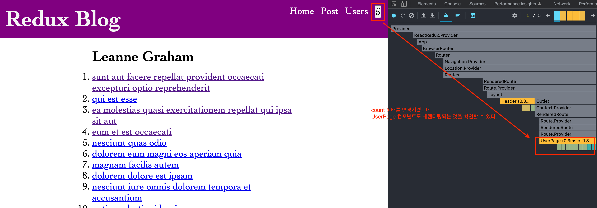
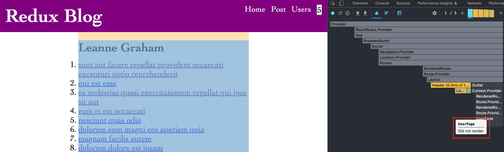

## 05. React Redux Performance Techniques and Optimizations

### the cause of re-renders



```js
// features/users/UserPage.js
import { useSelector } from "react-redux";
import { selectUserById } from "./usersSlice";
import { selectAllPosts } from "../posts/postsSlice";
import { Link, useParams } from "react-router-dom";

function UserPage() {
  const { userId } = useParams();
  const user = useSelector(state => selectUserById(state, Number(userId)));

  const postsForUser = useSelector(state => {
    const allPosts = selectAllPosts(state);
    return allPosts.filter(post => post.userId === Number(userId));
  });

  const postTitles = postsForUser.map(({ id, title }) => (
    <li key={id}>
      <Link to={`/post/${id}`}>{title}</Link>
    </li>
  ))

  return (
    <section>
      <h2>{user?.name}</h2>

      <ol>{postTitles}</ol>
    </section>
  )
}

export default UserPage
```

* UserPage 컴포넌트를 보면 `postsForUser` 변수가 있는 것을 확인할 수 있는데
  * 모든 포스트를 가져온 후 `post.userId`만 같은 것을 filtering한다.
* `count` 상태를 변경시키면 `useSelector`가 재실행되어 컴포넌트를 재렌더링시킨다.
* we can fix all of this by creating a memorized selector

### createSelector 사용하기

```js
export const selectPostsByUser = createSelector(
  [selectAllPosts, (state, userId) => userId],
  (posts, userId) => posts.filter(post => post.userId === userId)
);
```

### UserPage 컴포넌트에 적용하기

```js
// const postsForUser = useSelector(state => {
//   const allPosts = selectAllPosts(state);
//   return allPosts.filter(post => post.userId === Number(userId));
// });
const postsForUser = useSelector(state => selectPostsByUser(state, Number(userId)));
```
### 결과 확인하기



## state normalization

### Normalization

* Recommended in docs
* No duplication of data
* Creates an ID lookup

### createEntityAdapter API

* Abstracts more logic from components
* Built-in CRUD methods
* Automatic selector generation
* the best part of using normalized data with redux toolkit is that redux toolkit offers a createEntityAdapter API and that will make your slices less complicated and easier to manage